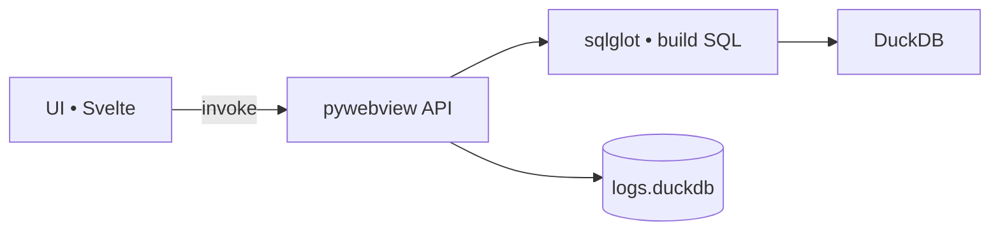
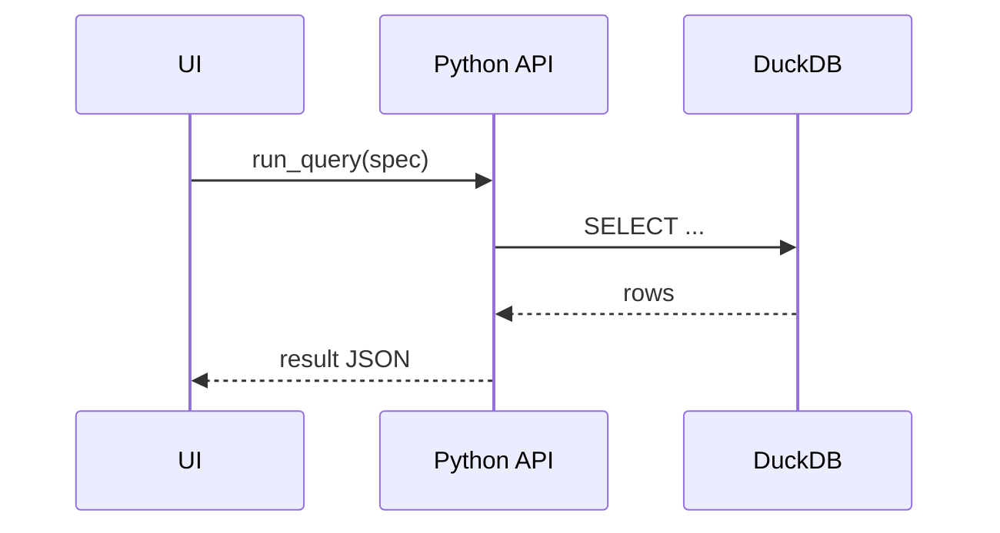

# Diagrams

## Mermaid (flowchart)

```mermaid
flowchart LR
  A[UI • Svelte] -->|invoke| B[pywebview API]
  B --> C[sqlglot • build SQL]
  C --> D[DuckDB]
  B --> E[(logs.duckdb)]
```

## Mermaid (sequence)

```mermaid
sequenceDiagram
  participant UI
  participant PY as Python API
  participant DB as DuckDB
  UI->>PY: run_query(spec)
  PY->>DB: SELECT ...
  DB-->>PY: rows
  PY-->>UI: result JSON
```
